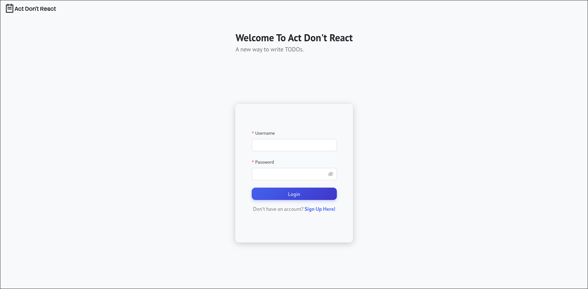
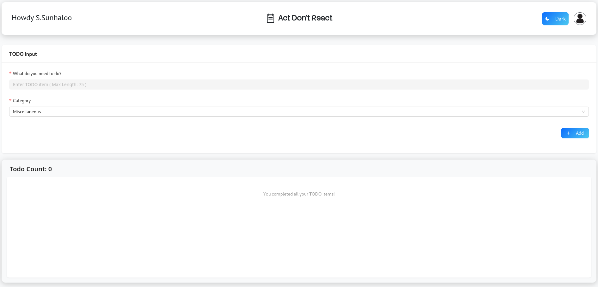
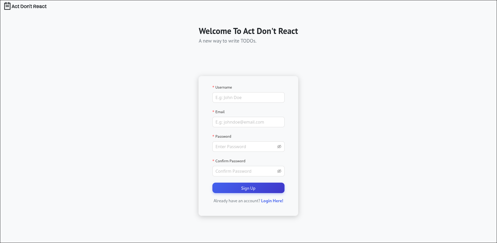
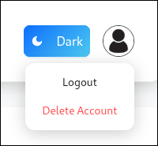
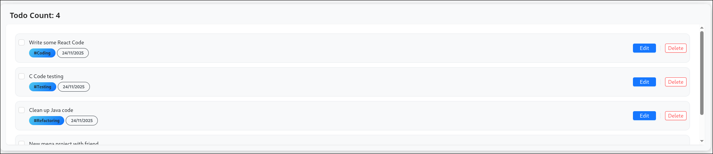
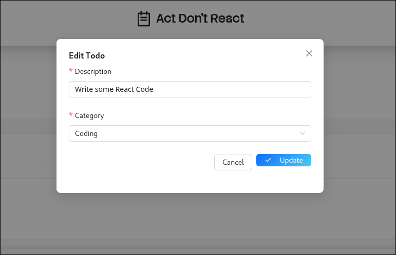
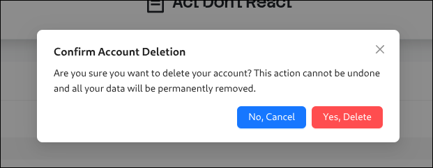
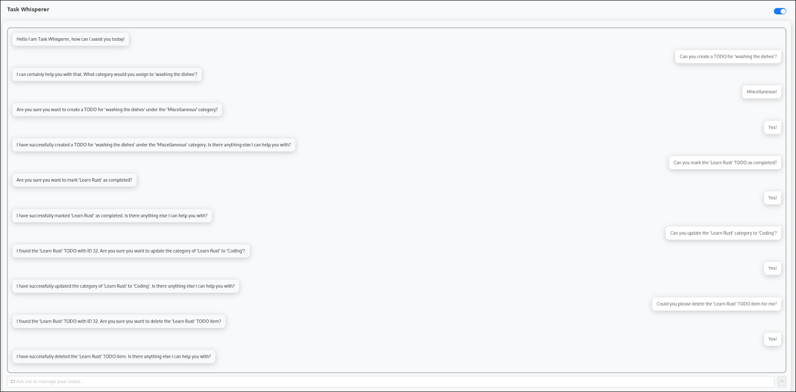
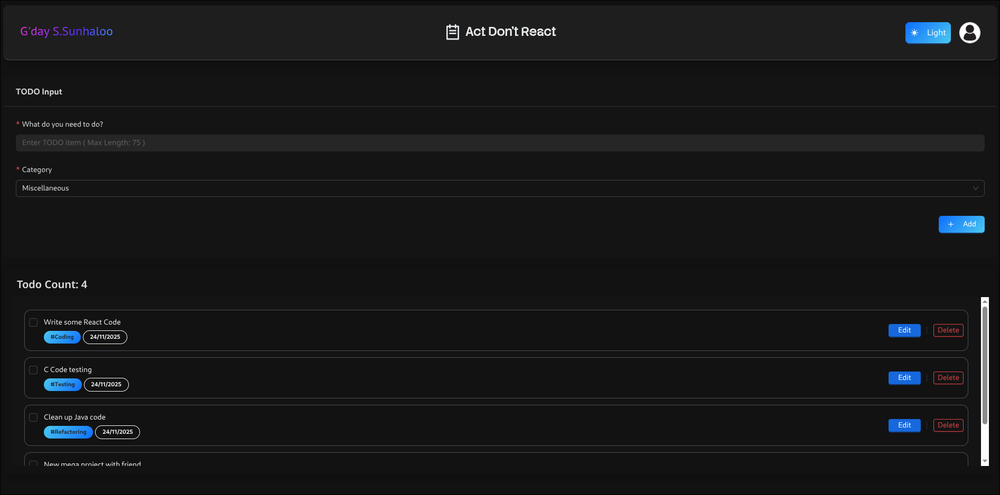

# First TODO React Application

A simple, responsive TODO with AI chatbot, web application built with React, CSS and JavaScript with a database back-end.

> [!NOTE]
> Resources used while building and learning:
>
> - Official React documentation: <https://reactjs.org/>
> - Various tutorials and community examples for UI patterns and local storage usage
> - All my learning, failures and experimentation are found in the `learning.md` file

# Features

- Light and Dark themes
- AI Assistant / Chatbot
- Category selection for each TODO item
- Mark TODOs as completed ( check-off )
- Edit TODO item content ( category immutable )
- Delete TODO items
- Persistent storage using local storage
- Enter a username to personalize the experience

# Usage

## Login And / Or Registration

Upon opening the web-app, the user will be welcomed with:

If the user is already an _existing_ user; then he / she simply needs to log into the web-app. Else if user is a _new_ user; then he will have to **sign up** / **register** for an account.

## Homepage

This is where a user is going to be spending most of his time in. As you can see from the above screenshot; the user is able to:

- Toggle the page's theme
- 'Logout' or 'Delete Account' from the profile menu
- Create a new 'TODO' item with a category ( _defaults to 'Miscellaneous'_ )
- Edit already created 'TODO' item
- Check-off completed 'TODO' item
- Finally, we can delete an entire 'TODO' item

---

## AI Assistant / Chatbot Issues

There are some things that I need to tell you about the AI chatbot in my system.

The thing is... The AI chatbot does it job very nicely and is able to actually perform 'CRUD' operations.

> But there is something that I will have to tell you!

I am a cheap bastard! Therefore, the AI assistant that is being hosted using vercel over at 'https://first-todo-react-dstv.vercel.app' is going to be **rate limited** very quickly.

> This is simply because I don't want to pay!!!

I am currently using Google's Gemini 'google-2.5-flash' model. Now since the inception of Gemini... They were giving us I think 1k requests per day! Not they dropped it down to 2 fucking 50!

> This happened around the 6 - 7 of December of 2025!

> [!NOTE]
>
> I am going to take a _look_ at [Qwen's API](https://qwen.ai/apiplatform) as I think they give you around 2k requests per day which is good if many people are going to use it!
>
> But don't quote me on that!

> [!WARNING] The Chatbot Branch
>
> On the `main` branch I am using the 'google-2.5-flash' model ( _for "production"_ ).
>
> But for testing purposes; on the `chatbot` branch I am using the 'openai/gpt-oss-20b:free' model by [Openrouter](https://openrouter.ai/).
>
> Again for testing purposes and to see how [Langchain]() handles different providers and models.
>
> > BTW the 'gpt-oss' model is so, so, so much **better**!

---

## Screenshots

### Light Mode

- Sign Up Page:

- Profile Menu:

- 'TODO' Item Created:

- Edit TODO:

- Account Deletion:

- AI Assistant / Chatbot:

### Dark Mode

- Homepage:

